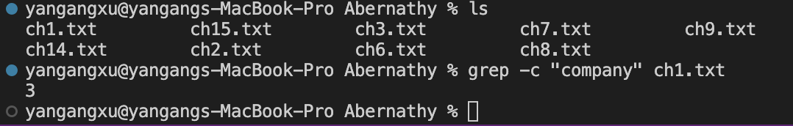
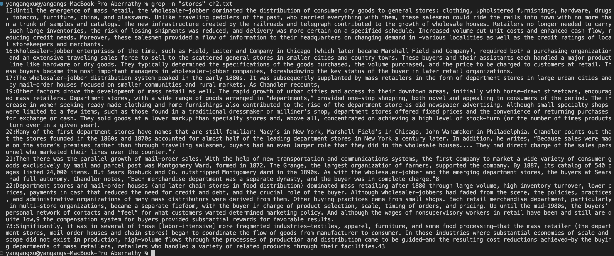
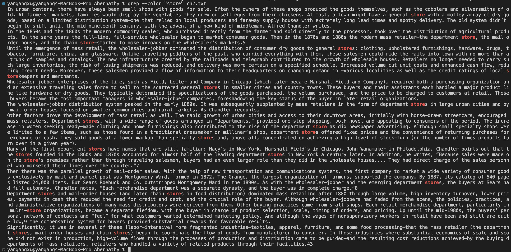
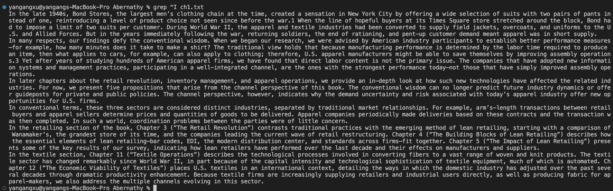
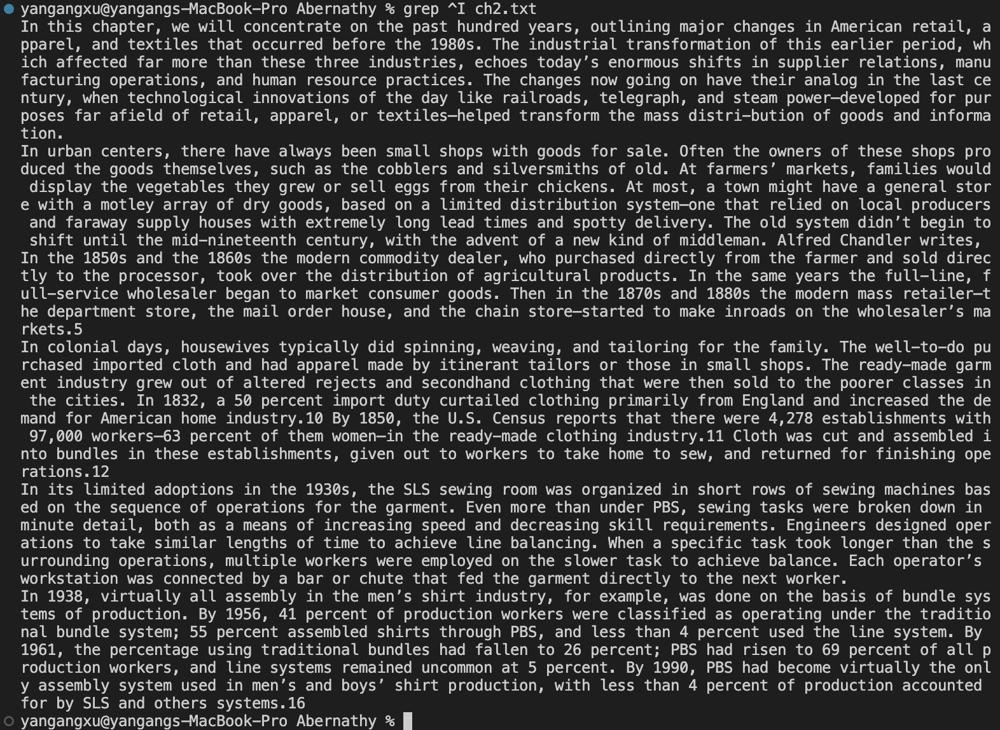

My favorite lab report is lab report 3. I did some exploration for `find` in lab report 3. I am going to do some exploration for `grep` this time. I feel those commands are useful for me. I did this task by searching how to use `grep` command online. I also can use ChatGPT to know how to use those commands. I like to search online because I can learn more about how to use those commands and get more explanations from different websites. Looking at the different websites helps me understand how to use those commands and what those commands do.


## Count the lines where strings are matched

The command will count the total number of lines where the string pattern appears in the file.

Source: [Link](https://www.digitalocean.com/community/tutorials/grep-command-in-linux-unix)


Example1 :

Command: 

```grep -n "company" ch1.txt```

Output:



Example2 :

Command: 

```grep -c "stores" ch2.txt```

Output:


## To number the lines where the string pattern appears in the file.

The command will show the number of each line where the search string are matched.

Source: [Link](https://www.digitalocean.com/community/tutorials/grep-command-in-linux-unix)

Example1 :

Command:

 ```grep -n "company" ch1.txt```

Output:


Example2 :

Command: 

```grep -n "stores" ch2.txt```

Output:



## Colorizing Grep results

The command will show the search string in different color from the rest of the text.

Source: [Link](https://www.digitalocean.com/community/tutorials/grep-command-in-linux-unix)


Example1 :

Command:

```grep --color "company" ch1.txt```

Output:


Example2 :

Command:

```grep --color "store" ch2.txt```

Output:



## Print lines begining with certain character.

The command will print all lines beginning with certain character.

Source: [Link](https://www.digitalocean.com/community/tutorials/grep-command-in-linux-unix)

Example 1 :

```grep ^I ch1.txt```

Output: 



Example 2 :

```grep ^I ch2.txt```


