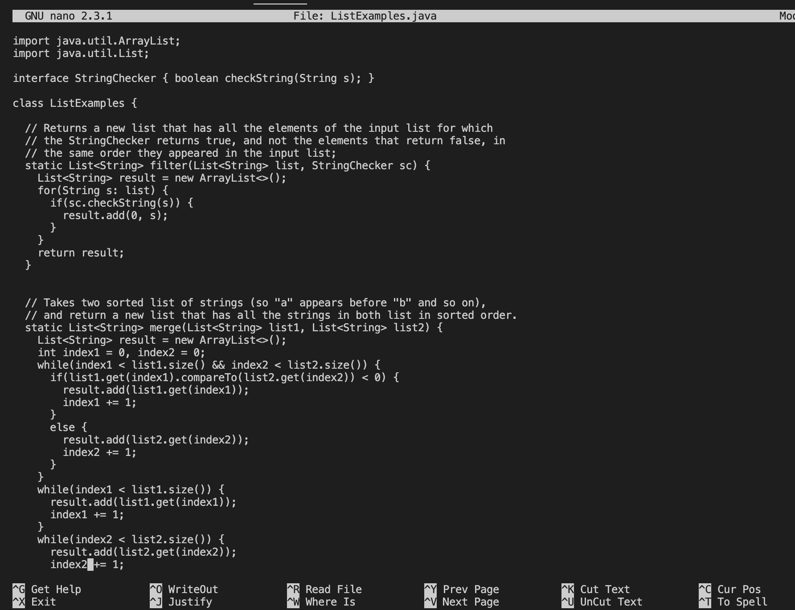

# Lab-Report-Lab4

## 4. Log into ieng6


The first step for log into ieng6 is to use ```control + R``` to search the command from command history. After pressed ```control + R```, then enter ```ssh``` to search the ```ssh``` command which is ```ssh cs15lwi23apb@ieng6.ucsd.edu```, from the command history, then press `<Enter>`. It will log into the account without typing the password, because I have aready setup the ```ssh key``` for ```ieng6``` account.

## 5 Clone your fork of the repository from your Github account


First, go to the ```Github``` page, find the fork of the repository, then use ```command + C``` to copy the ```ssh``` clone URL. After I copied the clone URL from the ```Github```, then go back to the terminal, type ```git clone``` then paste the ```ssh``` URL link, then press `<Enter>`, It will clone my fork of the repository from my Github account. 

## 6. Run the tests, demonstrating that they fail


First, I have to change the current dirctory to ```lab7``` dirctory, I type ```cd lab7``` on the terminal, then press `<Enter>`, to change to ```lab7``` directory. Then, I press ```control + R```, then I type ```javac```, to search the command ```javac -cp .:lib/hamcrest-core-1.3.jar:lib/junit-4.13.2.jar *.java```, then press `<Enter>` to compile java files in the directory. After that, I press ```Control + R```, then type ```runner``` to search the command ```java -cp .:lib/hamcrest-core-1.3.jar:lib/junit-4.13.2.jar org.junit.runner.JUnitCore ListExamplesTests```, then press `<Enter>` to run the ```Junit Test```. It shows that there are two test run, one test failures.

## 7. Edit the code file to fix the failing test



I type ```nano ListExamples.java```, then press `<Enter>` to open the ```ListExamples.java``` file, then I can see the code, it shows in the first image. After than, I press the key ```down``` to move to the bottom. I see the bug on the bottom, shows in the second picture. It should be ```index2 += 1;```, not ```index1 += 1;```. The last image shows the code after I fixed it. Then, I press ```Control + X``` to exit the file, and type ```y``` and press `<Enter>` to save the change and exit the file.

## 8. Run the tests, demonstrating that they now succeed


I used the same way as I did in step 6 to run the test. First, I press ```control + R```, then I type ```javac```, to search the command ```javac -cp .:lib/hamcrest-core-1.3.jar:lib/junit-4.13.2.jar *.java```, then press `<Enter>` to compile java files in the directory. After that, I press ```Control + R```, then type ```runner``` to search the command ```java -cp .:lib/hamcrest-core-1.3.jar:lib/junit-4.13.2.jar org.junit.runner.JUnitCore ListExamplesTests```, then press `<Enter>` to run the ```Junit Test```. It shows ```OK```. It show in the image above.


## 9. Commit and push the resulting change to your Github account (you can pick any commit message!)


I type ```git add .```, then press `<Enter>`. Then, I type ```git commit "Updated"```, and press `<Enter>`  to commit the changes. The last setp is that I type ```git push``` and press `<Enter>` to push the changes into the Github Account. It shows in the image above.
